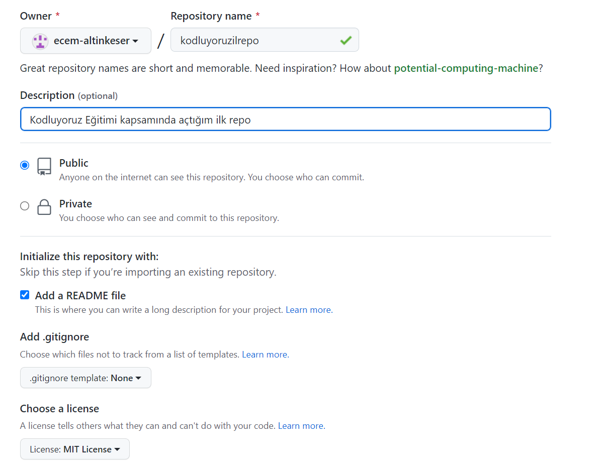

# kodluyoruzilkrepo
BU repo Kodluyoruz Eğitiminde oluşturduğumuz ilk repo. İçerisinde bir adet README dosyası, bir adet de index.html barındırıyor.



## Installation
---
Öncelikle projeyi clonelayın.

```
git clone https://github.com/ecem-altinkeser/kodluyoruzilkrepo.git
```

## Usage
---
```
cd kodluyoruzilkrepo
code .
```

## Contributing
---
Pull requestler kabul edilir. Büyük değişiklikler için, lütfen önce neyi değiştirmek istediğinizi tartışmak için bir konu açınız.

License
---
[MIT](https://choosealicense.com/licenses/mit/)